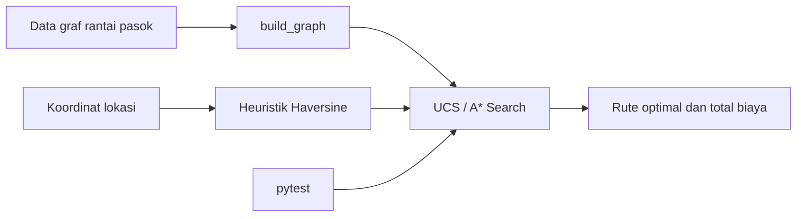

# TobaTrace — Sistem Copilot Cerdas Kepatuhan Ekspor & Ketertelusuran Kopi Sumatera (EUDR Compliance Copilot)

> Tugas Mata Kuliah **10S3001 - Kecerdasan Buatan (Artificial Intelligence)**
> Program Studi Sarjana Sistem Informasi — Institut Teknologi Del
> Milestone Proyek Terpadu (PjBL) — Semester Gasal 2026/2027

## 1. Ringkasan Proyek

**TobaTrace** adalah purwarupa *Enterprise AI Assistant / Copilot* yang membantu
koperasi dan eksportir kopi arabika Sumatera (kawasan Danau Toba) memenuhi
persyaratan **EU Deforestation Regulation (EUDR)** — regulasi Uni Eropa yang mewajibkan
setiap lot kopi yang diekspor terbukti *deforestation-free*, legal, dan dapat
ditelusuri hingga titik geolokasi kebun petani.

Copilot ini akan (di milestone-milestone berikutnya) membantu staf ekspor:
- Menjawab pertanyaan berbasis dokumen kebijakan/SOP internal & regulasi EUDR (RAG).
- Menghitung rute logistik kopi dari kebun ke pelabuhan ekspor secara optimal (Search).
- Mengecek kelengkapan dokumen *Due Diligence Statement* (DDS) via *tool calling* (MCP).
- Menyajikan dashboard interaktif untuk staf non-teknis (Gradio).

## 2. Status Milestone

| Milestone | Status | Deskripsi |
|---|---|---|
| M1 (W02) | ✅ Selesai | Problem Framing, PEAS, Baseline Search (UCS/A*), Setup Repo |
| M2 (W04) | ⏳ Belum dikerjakan | Business Constraint Solver (CSP/GA) |
| M3 (W07) | ⏳ Belum dikerjakan | Knowledge Base & Vector Search (ChromaDB) |
| M4 (W11) | ⏳ Belum dikerjakan | AI Agent Pipeline (LLM + RAG + MCP) |
| M5 (W13) | ⏳ Belum dikerjakan | Web Interaktif (Gradio) |

## 3. Struktur Repositori

```
tobatrace-ai/
├── README.md
├── pyproject.toml          # dependensi & konfigurasi environment (Astral uv)
├── .gitignore
├── src/
│   └── search_baseline.py  # modul UCS & A* Search (Milestone 1)
└── tests/
    └── test_search_baseline.py         # pytest unit test
```

PDF laporan dikumpulkan melalui ECourse sesuai format penamaan tugas. PDF tidak
menjadi dependensi runtime dan tidak wajib disimpan di repository.

## 4. Arsitektur Baseline



## 5. Problem Framing dan PEAS

### Problem framing

Koperasi dan eksportir kopi arabika Sumatera membutuhkan rute logistik yang
efisien dari titik pengumpulan menuju Pelabuhan Belawan. Perencanaan manual
dapat menghasilkan biaya transportasi lebih tinggi, waktu tempuh lebih lama,
dan keputusan yang sulit diaudit. TobaTrace menggunakan pencarian graf sebagai
baseline yang transparan sebelum fitur dokumen EUDR, kendala inspeksi, dan
pelacakan real-time ditambahkan pada milestone berikutnya.

### Spesifikasi PEAS

| Elemen | Spesifikasi terukur |
|---|---|
| **Performance measure** | Meminimalkan total biaya/jarak rute, menghasilkan rute valid dari kebun ke pelabuhan, mempertahankan biaya A* sama dengan UCS, serta mencatat jumlah simpul yang diekspansi. |
| **Environment** | Simpul kebun, pengumpul, pengolahan, gudang, hub logistik, dan Pelabuhan Belawan; edge berisi estimasi jarak darat. Baseline bersifat **fully observable, known, deterministic, static, discrete, sequential, single-agent**. Operasi nyata dapat menjadi dinamis, stochastic, partially observable, dan multi-agent. |
| **Actuators** | Menghasilkan rekomendasi urutan lokasi/rute, memilih edge berikutnya, mengembalikan total biaya, dan memberikan peringatan jika rute tidak ditemukan. |
| **Sensors** | Data adjacency graph, koordinat latitude/longitude, estimasi biaya atau jarak edge, titik awal, dan titik tujuan. Pada milestone lanjutan dapat ditambah status kendaraan, dokumen DDS, cuaca, dan slot inspeksi. |

### Formulasi ruang keadaan

- **X**: seluruh simpul lokasi pada graf rantai pasok.
- **A**: perpindahan dari satu simpul ke simpul tetangganya.
- **T(s, a)**: transisi deterministik ke simpul tujuan edge.
- **G**: keadaan tercapai ketika simpul sama dengan `Pelabuhan_Belawan`.
- **C(s, a, s')**: estimasi jarak tempuh edge dalam kilometer sebagai proxy biaya logistik.

## 6. Bukti Kolaborasi GitHub

Tabel berikut mencantumkan satu commit yang mewakili kontribusi setiap anggota. Riwayat lengkap commit dapat dilihat pada halaman Commits repository.

| Anggota | Kontribusi | Tautan commit |
|---|---|---|
| Joice | Arsitektur AI dan model | [d3cf816](https://github.com/PaulaTambunan/TobaTrace-AI/commit/d3cf816) |
| Paula Tambunan | Data, knowledge, QA, dan evaluasi | [94b2708](https://github.com/PaulaTambunan/TobaTrace-AI/commit/94b2708) |
| Ester | Integrasi dan interface | [a3265f5](https://github.com/PaulaTambunan/TobaTrace-AI/commit/a3265f5) |

## 7. Cara Menjalankan (Astral `uv`)

Proyek ini memakai [Astral `uv`](https://docs.astral.sh/uv/) sebagai package manager
Python modern untuk memastikan environment tim konsisten.

```bash
# 1. Install uv (sekali saja, jika belum ada)
curl -LsSf https://astral.sh/uv/install.sh | sh

# 2. Clone repositori
git clone https://github.com/<org-tim>/tobatrace-ai.git
cd tobatrace-ai

# 3. Sinkronisasi environment & dependensi
uv sync

# 4. Jalankan modul baseline search
uv run python src/search_baseline.py

# 5. Jalankan seluruh pengujian otomatis
uv run pytest -v
```

Jika `uv` belum tersedia, alternatif dengan `pip` standar:
```bash
python -m venv .venv
source .venv/bin/activate   # Windows: .venv\Scripts\activate
pip install -r requirements.txt
python src/search_baseline.py
pytest -v
```

## 8. Anggota Tim & Peran

| Nama | NIM | Peran |
|---|---|---|
| Joice | 12S24020 | AI Architecture & Model Lead |
| Paula Tambunan | 12S24025 | Data & Knowledge Engineer **+** QA, Evaluation & Ethics Lead |
| Ester | 12S24050 | Integration & Interface Engineer |

## 9. Lisensi

Proyek ini dibuat untuk keperluan akademik (tugas kuliah) — MIT License (lihat `LICENSE`).
